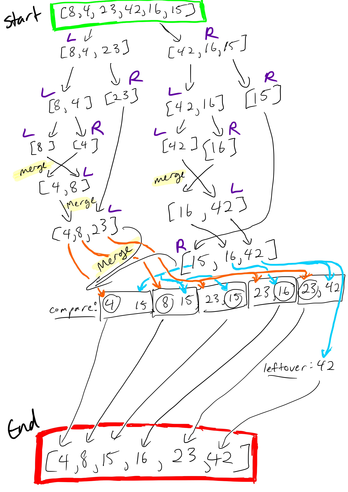

# Merge Sort Blog
Welcome to day two of sort blog week! We will be looking at the following algorithm today:

```js
input <-- [8,4,23,42,16,15];
ALGORITHM Mergesort(arr)
    DECLARE n <-- arr.length
           
    if n > 1
      DECLARE mid <-- n/2
      DECLARE left <-- arr[0...mid]
      DECLARE right <-- arr[mid...n]
      // sort the left side
      Mergesort(left)
      // sort the right side
      Mergesort(right)
      // merge the sorted left and right sides together
      Merge(left, right, arr)

ALGORITHM Merge(left, right, arr)
    DECLARE i <-- 0
    DECLARE j <-- 0
    DECLARE k <-- 0

    while i < left.length && j < right.length
        if left[i] <= right[j]
            arr[k] <-- left[i]
            i <-- i + 1
        else
            arr[k] <-- right[j]
            j <-- j + 1
            
        k <-- k + 1

    if i = left.length
       set remaining entries in arr to remaining values in right
    else
       set remaining entries in arr to remaining values in left
```

## Beginning

We start by assigning `n` with the length of the array. `n` is `6`, so we enter the first if statement, and get the `mid`, `left`, and `right` from there. So our variables start like this:
```
arr = [8,4,23,42,16,15];
n = 6;
mid = 3;
left = [8,4,23];
right = [42,16,15];
```
The next after this we will recursively do the same thing, starting with the left array. 
```
arr = [8,4,23]
n = 3;
mid = 2;
left = [8,4];
right = [23];
```
Again left side!
```
[8,4]
n = 2;
mid = 1;
left = [8];
right = [4];
```
Now the array are both small enough that when we will not enter the if statement for `Mergesort` left or right, so we go on to the next function, `Merge` with (`[8]`, `[4]`, `[8,4]`).

## Merge Function
```
left = [8]
right = [4]
arr = [8,4]
i = 0
j = 0
k = 0
```
We start with the above variable values, so we will enter the first `while` loop. `left[i]`(8) is greater than `right[j]`(4), so we enter the else statement, and assign 4 to `arr[k]`. We then increase `j` and `k` by 1.
```
left = [8]
right = [4]
arr = [4,4]
i = 0
j = 1
k = 1
```
`j` is not less than `right.length` so we exit the while loop. Since i does not equal `left.length` we go to the next `else` statement, and set the rest of the array to the rest of left, and the array becomes `[4,8]`
```
left = [8]
right = [4]
arr = [4,8]
```
This sorted fragment will now bubble up to the Mergesort(left) of the subarray `[8,4,23]`, and we will now have a left in that array of `[4,8]` and a right of `[23]`, and we will use the same merge function to bring those together to make the `left` of the full array `[4,8,23]`.  

### Fast Forward >>

The same thing will happen now with the Mergesort of the `right` of the original array, and we will have a left of `[4,8,23]` and a right of `[15,16,42]`, and we will arrive at the Merge of the orginal array, so let's walk through that Merge function. 

```
left = [4,8,23]
right = [15,16,42]
arr = [8,4,23,42,16,15]
i = 0
j = 0
k = 0
```
We will enter the while loop and since the first number of left is less than the first number of right, we put that at the beginning of the array. This works now because we know that both arrays are sorted. We then increase i and k.
```
left = [4,8,23]
right = [15,16,42]
arr = [4,4,23,42,16,15]
i = 1
j = 0
k = 1
```
We do the same thing again, but now add `left[1]` to `arr[1]`
```
left = [4,8,23]
right = [15,16,42]
arr = [4,8,23,42,16,15]
i = 2
j = 0
k = 2
```
This next time, `left[i]` is greater than `right[j]`, so we put the `j` value into the array, and increase `j`.
```
left = [4,8,23]
right = [15,16,42]
arr = [4,8,15,42,16,15]
i = 2
j = 1
k = 3
```
We will continue to go back and forth like this a couple more times.
```
left = [4,8,23]
right = [15,16,42]
arr = [4,8,15,16,16,15]
i = 2
j = 2
k = 4
```
```
left = [4,8,23]
right = [15,16,42]
arr = [4,8,15,16,23,15]
i = 3
j = 2
k = 5
```
At this point, `i` is not less than the length of `left` so we exit the `while` loop. We add on the rest of right to get the final sorted array:
`[4,8,15,16,23,42]`

