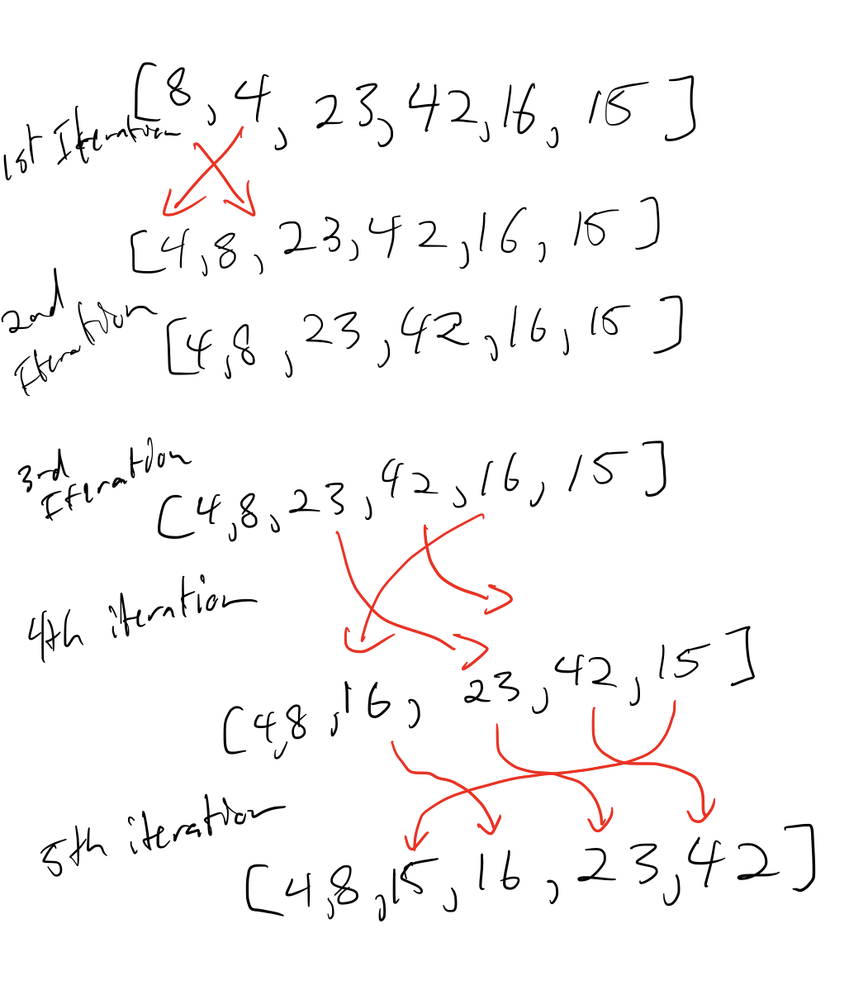

# Sort Blog

This blog post will explore the following function and see how it sorts an array step by step. We will work with the input `[8,4,23,42,16,15]`


### 1st Iteration
When we start the function, the variables will be assigned the following: 
```js
i = 1;
j = 0;
temp = 4;
```
`j` is greater than or equal to `0` and `temp` (4) is less than `arr[j]` (8) so we will enter the `while` loop. `arr[j+1]` will be assigned the value of `arr[j]` (8). `j` will be reduced by 1. Since `j` is now `-1`, we exit the loop, and `arr[j+1]` (0), will be assigned the temp value, which is `4`. After the first iteration of the `for` loop, our array will be `[4,8,23,42,16,15]`

### 2nd Iteration
```js
i = 2;
j = 1;
temp = 23;
```
The second time we will not enter the `while` loop because `temp` is greater than `arr[j]`(8). `temp` is set to `arr[j+1]` which is where is already was, and the array stays the same. `[4,8,23,42,16,15]`

### 3rd Iteration
```js
i = 3;
j = 2;
temp = 42;
```
Since `temp` is the highest number again so far in the array, we do not enter the while loop, and nothing in the array changes.
`[4,8,23,42,16,15]`

### 4th Iteration
```js
i = 4;
j = 3;
temp = 16;
```
Finally `temp` is less than numbers before it. We will enter the while loop, and since `42` is greater than `16`, we put `42` at that place in the array, so the array becomes `[4,8,23,42,42,15]`. Since `temp` is less than `23` we do the same thing with `23` and the array becomes `[4,8,23,23,42,15]`. `temp` is greater that `8` so we exit the while loop and put `temp` at the next index. The array becomes `[4,8,16,23,42,15]`
### 5th Iteration
```js
i = 5; 
j = 4;
temp = 15;
```
The pattern is now clear. We will compare `temp` with every previous element in the array until we find where it is higher than an element, and we stick it after that element. As we do this, we copy and paste each element in the array that is greater than `temp` one index higher. The end result will be this: `[4,8,15,16,23,42]`.




